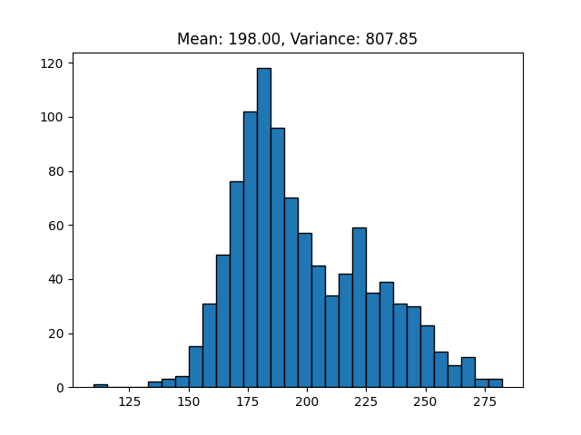
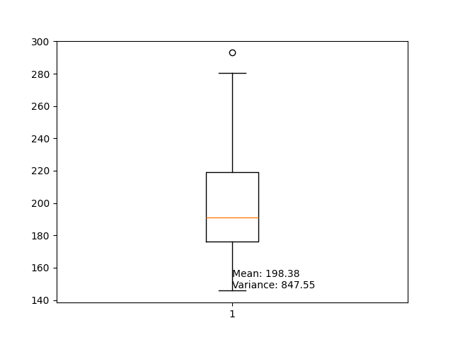
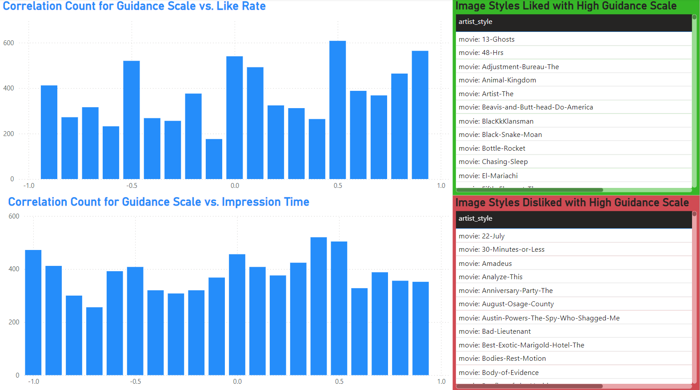

# Research Project: The Impact of Hyperparameters on Generated Image Likability using Stable Diffusion

## Overview

This research project investigates how various hyperparameters influence the likability of images generated using Stable Diffusion models. Specifically, we examined the guidance scale, inference steps, and prompts. Over several years, we collected data from students who rated the likability of generated images. Our goal was to identify correlations between these hyperparameters and image likability, ensuring that the influence of prompts was effectively controlled.

## Objective

The primary objectives of this study are:
1. To understand the impact of guidance scale on the likability of generated images.
2. To analyze how varying inference steps affect image likability.
3. To ensure that the prompt used does not significantly influence the correlation results.

## Methodology

### Data Collection

We gathered data from student ratings on the likability of images generated using different hyperparameter configurations in Stable Diffusion models. Each configuration varied systematically to isolate the effects of guidance scale and inference steps.

### Prompt Embedding and Similarity

To convert prompts into embeddings, we employed DistilBERT with a 512-dimensional vector space. This allowed us to numerically represent the prompts. We set a distance threshold to identify similar embeddings, ensuring that prompts used in different tests were similar enough to avoid skewing the results.

### K-Nearest Neighbors (KNN) Clustering

We utilized KNN clustering to group similar prompts based on their embeddings. This approach facilitated the mass labeling of prompts for similarity in sentiment using GPT-3.5 Turbo, ensuring that prompt variability did not significantly influence the likability ratings. The clustering process involved:
1. Converting each prompt into a vector using DistilBERT.
2. Calculating pairwise distances between prompt vectors.
3. Applying KNN clustering to group prompts based on a predefined similarity threshold.
4. Labeling clusters for sentiment similarity using GPT-3.5 Turbo to maintain consistency.

Overall, we identified that an embedding distance below 170.00 typically returns high sentiment similarity. 

As seen in the distance distribution graph, our data shows a wide spread of prompts:

The box plot further illustrates the spread and highlights potential outliers in the data:

### Correlation Analysis

We conducted a detailed correlation analysis by:
1. Grouping the data by inference steps to analyze the correlation between guidance scale and likability.
2. Grouping the data by guidance scale to examine the effect of inference steps on likability.
3. Analyzing the correlations across different art styles to identify any underlying patterns.

We used the Pearson correlation coefficient to quantify these relationships. Below is an example of the correlation distribution by art style categories. All hyperparameters exhibit a similar shape:

## Results

The key findings of our analysis are as follows:
1. **Prompt Similarity Control**: By using embeddings and KNN clustering, we ensured that prompt similarity did not significantly influence the likability ratings, validating our clustering methodology.
2. **Guidance Scale and Likability**: The correlation between guidance scale and likability exhibited a wide distribution, ranging from -1 to 1, indicating no consistent trend.
3. **Inference Steps and Likability**: Similar to the guidance scale, inference steps also did not show a consistent trend in their effect on likability, as evidenced by varying correlation coefficients.
4. **Art Style Grouping**: When grouping by art styles, the correlations between hyperparameters and likability were evenly distributed, suggesting that the hyperparameters' effects are independent of the art style. 

## Conclusion

Our research concludes that while guidance scale and inference steps are crucial parameters in the Stable Diffusion model, their direct impact on the likability of generated images is not consistent. The influence of prompts was effectively neutralized through embedding and clustering techniques, ensuring a fair analysis of hyperparameters. Future work could explore additional hyperparameters and leverage more sophisticated models to further understand the complex dynamics influencing image likability.

## Author
Runze Wang, Prof.Kenneth S. Goodman

